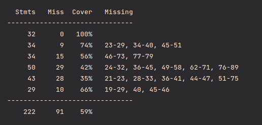
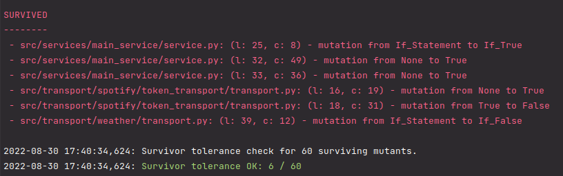

# isis_api

<hr>

<p align="center">
  <a href="#projeto">About the project</a>&nbsp;&nbsp;&nbsp;|&nbsp;&nbsp;&nbsp;
  <a href="#tecnologias">Technologies</a>&nbsp;&nbsp;&nbsp;|&nbsp;&nbsp;&nbsp;
  <a href="#instalacao">How to install</a>&nbsp;&nbsp;&nbsp;|&nbsp;&nbsp;&nbsp; 
  <a href="#execução">How to execute it</a>&nbsp;&nbsp;&nbsp;|&nbsp;&nbsp;&nbsp; 
  <a href="#response">Response</a>&nbsp;&nbsp;&nbsp;|&nbsp;&nbsp;&nbsp; 
  <a href="#testes">API TESTS</a>&nbsp;&nbsp;&nbsp;|&nbsp;&nbsp;&nbsp; 
</p>

## <a id="projeto"> 💻 ABOUT THE PROJECT </a>

This is a microservice able to accept RESTFUL requests receiving as parameter either city name or lat long 
coordinates and returns a playlist (only track names is fine) suggestion according to the current temperature.`.

Some functionalities present on this project:

    * Route to return musics of a playlist according to weather city or latitude and longitude;
    * Spotify Developer API consummer;
    * Weather Map API consummer;

<br>

🟩 PROJECT STATUS: <b>FINISHED</b> <br>

<hr>

## <a id="tecnologias"> 🧪 TECHNOLOGIES </a>

- Python 
- FAST API
- API Consumer
- Pydantic
- Pytest
- Mutation Tests

<hr>

## <a id="instalacao"> HOW TO INSTALL IT </a> 

<b>- Clone the repo with the following command:</b> `https://github.com/renatamoon/isis_api.git` <br>

<hr> 

#### On Windows

<b>- Create your virtual environment:</b> `python -m venv venv`<br>
<b>- Activate your virtual environment: </b>`. venv\Scripts\Activate.ps1`<br>
<b>Obs: If for any reason occurs and error:</b> on powershell execute the following command: `Set-ExecutionPolicy -Scope CurrentUser -ExecutionPolicy RemoteSigned`<br>
<b>- Execute requirements with the command: </b>`pip install -r requirements.txt`<br>

<hr> 

#### On Linux:

<b>- Create your virtual environment:</b> `python -m venv venv`<br>
<b>- Activate your virtual environment:</b> `source venv/bin/activate`<br>
<b>- Execute requirements with the command:</b> `pip install -r requirements.txt`<br>

<hr>

Create a project root `.env` file and change your local strings connections to do the properly connection <br>

```commandline
# AUTHORIZATION
CLIENT_ID=""
CLIENT_SECRET_KEY=""
SPOTIFY_TOKEN_URL="https://accounts.spotify.com/api/token"

# PLAYLISTS URLS
PARTY_PLAYLIST_URL="https://api.spotify.com/v1/playlists/37i9dQZF1DX7e8TjkFNKWH/tracks?market=BR&limit=7"
POP_PLAYLIST_URL="https://api.spotify.com/v1/playlists/74Zp7I7BsiFg4T7wFiV5Iu/tracks?market=BR&limit=7"
ROCK_PLAYLIST_URL="https://api.spotify.com/v1/playlists/6jmDxyne7FJ3fVA9CkGYpd/tracks?market=BR&limit=7"
CLASSIC_PLAYLIST_URL="https://api.spotify.com/v1/playlists/6dI1MmIBasFV59ritLTxIJ/tracks?market=BR&limit=7"

# OPEN WEATHER API
OPEN_WEATHER_API_KEY=""
COORDINATES_URL="https://api.openweathermap.org/data/2.5/onecall?lat=%s&lon=%s&appid=%s&units=metric"
CITY_WEATHER_URL="http://api.openweathermap.org/data/2.5/weather?"
```

<hr>

## <a id="execução"> EXECUTE HYPERCORN </a> 

- To Execute the application run the command: `uvicorn main:app --reload` or manually run the `main.py` file.

<hr>

## <a> USING THE SWAGGER (NATIVE FOR FAST API) </a> 

- To user the FastAPI user the router: `http:{your-host}/get_playlist_weather/docs`

## <a> REQUISITION ROUTER </a> 

- Use the router on your Postman/Insomnia/Swagger: `http:{your-host}/get_playlist_weather` ;

## <a> QUERY PARAMS </a> 

- search tracks by city, pass the query param: `city`
- search tracks by latitude and longitude, pass the query params: `latitude` & `longitude`

<hr>

## <a id="response"> API RESPONSES: </a> 

- Expected return of the route `/get_playlist_weather` when passing `city` query param:
```
{
    "tracks_for_you": [
        {
            "music_id": "5HCyWlXZPP0y6Gqq8TgA20",
            "artist_name": "Justin Bieber",
            "music_name": "STAY (with Justin Bieber)",
            "album_name": "STAY (with Justin Bieber)"
        },
        {
            "music_id": "4Dvkj6JhhA12EX05fT7y2e",
            "artist_name": "Harry Styles",
            "music_name": "As It Was",
            "album_name": "Harry's House"
        },
        {
            "music_id": "7mFj0LlWtEJaEigguaWqYh",
            "artist_name": "Dua Lipa",
            "music_name": "Sweetest Pie",
            "album_name": "Sweetest Pie"
        },
        {
            "music_id": "3DarAbFujv6eYNliUTyqtz",
            "artist_name": "Doja Cat",
            "music_name": "Kiss Me More (feat. SZA)",
            "album_name": "Planet Her"
        }
    ],
    "about_your_weather": {
        "city_or_timezone": "Delhi",
        "temperature": 29.05,
        "description": "mist"
    }
}
```
- Example of expected response of the route when an error happened:

```
{
    "request_status": false,
    "status": 2,
    "msg": "Error fetching data from Weather API"
}

```

## <a id="testes"> API TESTS: </a> 

- To get the coverage of the project tests run the command on root path: `pytest --cov-report term-missing --cov-config=.coveragerc --cov=src -v`
- To run the mutatest and get the mutants survivor tolerance, run the command on root path: `bash mutation_test.sh`

- <b>Coverage: </b>
<br>



- <b>Mutation Survivor Tolerance: </b>

